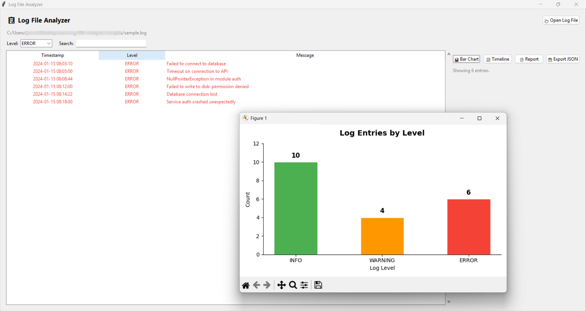

# Log File Analyzer

A Python desktop application that parses `.log` files and generates summaries, filters, and visualizations.

## Features

- Parse `.log` files with `INFO`, `WARNING`, `ERROR` levels
- Count entries per log level
- Filter by keyword, log level, or date range
- Generate summary report (total, first/last log, top errors)
- Export results to JSON
- Visualize log frequency with matplotlib (bar chart + timeline)
- CLI interface for automation
- Tkinter GUI for interactive analysis
- Handles malformed lines gracefully

## Architecture (MVC)

```

Log-File-Analyzer/
├── main.py                    # GUI entry point
├── cli.py                     # CLI entry point
├── model/
│   ├── log_entry.py           # LogEntry dataclass
│   ├── log_parser.py          # LogParser — regex parsing + filters
│   └── report.py              # ReportGenerator — summary report
├── utils/
│   ├── exporter.py            # JSON export
│   └── visualizer.py          # matplotlib charts
├── view/
│   └── app_view.py            # Tkinter GUI
├── controller/
│   └── app_controller.py      # Bridges View and Model
├── tests/
│   └── test_parser.py         # Unit tests
└── samples/
└── sample.log             # Sample log file for testing

```

## Requirements

```bash
pip install matplotlib
```

## How to run — GUI

```bash
python main.py
```

## How to run — CLI

```bash
# Parse and display report
python cli.py --file samples/sample.log

# Filter by level
python cli.py --file samples/sample.log --level ERROR

# Filter by keyword
python cli.py --file samples/sample.log --filter connection

# Export to JSON
python cli.py --file samples/sample.log --export output.json

# Show chart
python cli.py --file samples/sample.log --chart
```

## Running tests

```bash
python tests\test_parser.py
```

## Log format supported

```
2024-01-15 08:00:01 INFO Application started successfully
2024-01-15 08:03:10 ERROR Failed to connect to database
2024-01-15 08:02:45 WARNING Disk usage at 80%
```

## Screenshot


